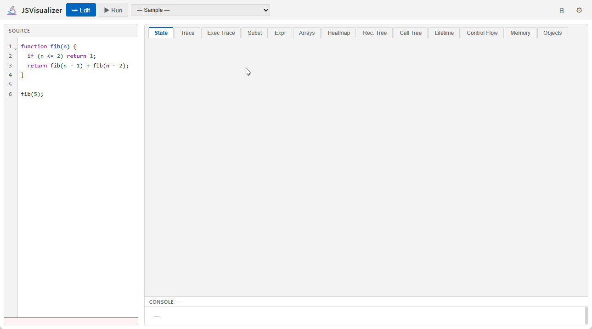

# JSVisualizer

> 🚀 **[Live Demo](https://tntetsu.github.io/JSVisualizer/)** — Hosted on GitHub Pages

> [日本語版 README はこちら](README.md)

> 📖 **[User manual](https://tntetsu.github.io/JSVisualizer/manual.en.html)** — also available from the “?” button at the top right of the app

An interactive, educational web application that visualizes JavaScript program execution step by step.

Step through your code at four levels of granularity and watch the program's behavior unfold across **12 visualization views**.



---

## Features

### Step Granularity (8-direction button grid)

The footer contains a 2-row × 4-column grid offering 4 granularities × forward/back = 8 step operations.

```
⏮  │  ◀◀Stmt  ◀Expr  ▶Expr  ▶▶Stmt  │  ⏭  ── slider ── counter
   │  ⏪Func   ◁Human ▷Human  ⏩Func  │
```

| Granularity | Buttons | Keyboard | Description |
|-------------|---------|----------|-------------|
| **Expr** | ◀Expr / ▶Expr | `b`/`←`, `n`/`→` | Every AST node evaluation (finest) |
| **Stmt** | ◀◀Stmt / ▶▶Stmt | `V` / `v` | Statement-level (skips sub-expressions) |
| **Human** | ◁Human / ▷Human | `H` / `h` | Meaningful change points: assignments, condition tests, loop updates |
| **Func** | ⏪Func / ⏩Func | `F` / `f` | Function call / return as a single unit |

Other: `Home` → first step, `End` → last step, `1`–`9` → switch tabs

### Code Highlighting (3 layers)

The code panel simultaneously displays three highlight layers:

| Layer | Color | Meaning |
|-------|-------|---------|
| Line highlight | 🟦 Blue (left border + background) | Currently executing line |
| Expression highlight | 🟧 Orange (semi-transparent) | Character range of the expression being evaluated |
| Call-site highlight | 🟣 Purple (dashed underline) | While inside a function, highlights the call expression that invoked it |

### Visualization Views (12 tabs)

The 12 views are organized along two axes: the **visualization target** (what is shown) and the **temporal representation** (how execution time is mapped onto the screen).

- **Visualization target**: eight targets grouped into three categories that correspond to common sources of learner difficulty
  - **State** — values held at a given moment (variable values, the call stack, stack/heap memory layout)
  - **Behavior** — how execution unfolds over time (expression evaluation order, statement execution order/count, function call order/cost). Expression, statement, and function call match three of the [step granularities](#step-granularity-8-direction-button-grid), so a learner who picks a granularity can find the matching view
  - **Compound types** — structured data (arrays, objects)
- **Temporal representation**
  - **Animation** — shows a single moment and updates in place at each step
  - **Timeline** — assigns one spatial axis to time and shows many moments at once

| Category | Target | Animation | Timeline |
|----------|--------|-----------|----------|
| **State** | Variable values | Variable | Exec Trace |
| | Call stack | Call Stack | Lifetime |
| | Memory layout | Memory | (not provided) |
| **Behavior** | Expression evaluation | Expr | Subst |
| | Statement execution | Control Flow | Heatmap |
| | Function calls | Call Tree | (not provided) |
| **Compound types** | Arrays | Arrays | Exec Trace |
| | Objects | Objects | (not provided) |

Every target has an animation view. Exec Trace serves as the timeline view for both variable values and arrays (it stacks an array + pointer mini diagram per step; see [ADR-037](docs/adr/ADR-037-exectrace-array-pointer-overlay.md)). Timeline views are provided only where each step's state reduces to a low-dimensional quantity (a value, a stack depth, a line hit count, a small array) whose whole history reads well along one axis. Memory layout and objects are already graphs at each moment, and a sequence of graphs is hard to read; for function calls, adjacent call-tree snapshots differ only in which node is highlighted, so a timeline adds little.

View details:

| Category | Tab | Temporal | Description |
|----------|-----|----------|-------------|
| **State** | Variable | Animation | Row-per-line variable matrix showing each line's values at its last execution. Source snippet in line column. Changed values highlighted in orange-bold. Column show/hide & drag-to-reorder |
| | Exec Trace | Timeline | Timeline view for both variable values and arrays. All humanStep events in execution order. Array + pointer mini diagram (only on steps where a pointer is detected; drag-resizable frame width) + variable columns + condition columns. while/for condition values shown per iteration |
| | Call Stack | Animation | Global + per-call-frame variable panel. Innermost frame first, labels like `factorial(6)` |
| | Lifetime | Timeline | Time on the horizontal axis and call-stack depth on the vertical axis; each frame (function call) is drawn as a band from when it starts to when it ends, labeled with the call and its arguments plus the frame's variables, showing how long local variables and arguments live |
| | Memory | Animation | Stack (scope frames) and heap (objects/arrays) in separate columns with SVG reference arrows |
| **Behavior** | Expr | Animation | Sub-expression evaluation: one statement's expression is progressively substituted toward its final value. Sub-expressions skipped by short-circuit evaluation stay unevaluated. Two-color highlights. Variable values updated in real time |
| | Subst | Timeline | Recursive calls shown as substitution-model expansion. Each `return` expression replaced step by step, with expansion (orange) and pending (blue-bold) highlights |
| | Control Flow | Animation | AST-based flowchart: if/else shown as side-by-side true/false branches; loops as condition + body. Unexecuted nodes grayed out — untaken branches visible at a glance |
| | Heatmap | Timeline | Execution count per line shown as "N/M times" + background color, updated per step. Execution timeline dots with SVG connector lines between transitions |
| | Call Tree | Animation | All function calls (recursive and non-recursive) as SVG tree. Subtree cost (`cost:N`) shown per node |
| **Compound types** | Arrays | Animation | Multiple arrays displayed as color-coded indexed boxes. Pointer variables shown in individual rows. Blocks separated by border + background, wrap when too wide |
| | Objects | Animation | Object/array reference graph as SVG (hierarchical layout, connected components auto-separated, nodes color-coded by depth) |

The tab order differs from the table above (Call Stack, Variable, Exec Trace, Subst, Expr, Arrays, Heatmap, Call Tree, Lifetime, Control Flow, Memory, Objects; keys `1`–`9` select the first nine in this order). This classification follows Table 1 of Tanaka & Ueda, "Proposal for Program Execution Environment that Visualizes Program Behavior Using Multiple Views" (IS-26-049); the array timeline, unimplemented when the paper was written, has since been implemented as part of Exec Trace.

`console.log` output always appears in the **always-visible panel** at the bottom of the right pane, regardless of which tab is selected.

### Editor Features

- **Syntax highlighting** — CodeMirror 6 with keyword/string/comment coloring (light/dark theme)
- **Pane resizer** — Drag the divider to resize the editor and visualization panes (width is saved)
- **Program name display** — Selecting a sample shows the sample name in the header

### Loading code from a URL query

Besides picking a built-in sample or pasting your own code, JSVisualizer can load code directly from a URL query string, driven by an external app (e.g. [BhvVisualizer](https://github.com/tntetsu/BhvVisualizer), or your own self-hosted static JSON). This works as a general-purpose "direct link to a specific piece of code" feature even when JSVisualizer is used standalone — it has nothing to do with the `# BHV:`-tagged logging wiring (see [ADR-031](docs/adr/ADR-031-url-based-exercise-loading.md) for the design background).

| Query parameter | Meaning |
|---|---|
| `exercise` | A **complete URL** to fetch an exercise (a set of code) from. When present, the sample selector's contents are **replaced** with the fetched codes instead of the built-in samples |
| `code` | A **complete URL** to fetch the specific code to display. When present, that code is loaded directly into the editor, and the sample selector is **replaced** with just that one code instead of the built-in samples |

`exercise`/`code` don't require JSVisualizer to know any ID scheme or API path convention — **the caller just passes a fetchable URL directly**. JSVisualizer fetches that URL and reads its `title`/`code` fields; it has no opinion on where the code is hosted (BhvVisualizer or anything else).

Behavior by combination:

| Params present | Behavior |
|---|---|
| `exercise` only | The sample selector is replaced with the exercise's code list (the 21 built-in samples disappear from it), and **the first one is automatically loaded into the editor**. If the exercise has a title, the sample selector's placeholder (normally "─ Sample ─") is replaced with it |
| `code` only | The specified code is loaded directly into the editor, and the sample selector's only option becomes that code |
| `exercise` + `code` | The sample selector stays as the exercise's code list, and the editor shows the code specified by `code` (which takes priority over the automatic first-code load). The selector's placeholder still becomes the exercise title |
| Neither | Nothing happens (editor stays on the default Fibonacci sample, and the 21 built-in samples are unaffected) |

While `exercise` or `code` is present, the built-in samples are **temporarily removed** from the sample selector, so they don't clutter a URL meant for a specific learning context ([ADR-033](docs/adr/ADR-033-hide-builtin-samples-when-remote.md)). Loading the page standalone, without either query param, still offers all 21 as before.

Examples:

```
# Direct link to a single piece of code
https://tntetsu.github.io/JSVisualizer/?code=https%3A%2F%2Fbhv-visualizer.web.app%2Fapi%2Fcodes%2Fabc123

# Open an exercise (first code shown automatically; others reachable via the sample selector)
https://tntetsu.github.io/JSVisualizer/?exercise=https%3A%2F%2Fbhv-visualizer.web.app%2Fapi%2Fexercises%2Fex1

# Open a specific code within an exercise
https://tntetsu.github.io/JSVisualizer/?exercise=https%3A%2F%2Fbhv-visualizer.web.app%2Fapi%2Fexercises%2Fex1&code=https%3A%2F%2Fbhv-visualizer.web.app%2Fapi%2Fcodes%2Fco2

# Point at a local development API (no dedicated bhvApiBase-style param needed — just point the URL locally)
https://tntetsu.github.io/JSVisualizer/?code=http%3A%2F%2Flocalhost%3A5000%2Fapi%2Fcodes%2Fabc123
```

`exercise`/`code` values must be URL-encoded (building them with `URLSearchParams` handles this automatically). If a URL doesn't exist or isn't public, an error message is shown in the error banner. Note that there is **no way to jump to a specific line or cursor position** — the URL query only controls which code gets loaded, not where the cursor lands.

#### Specifying the initial view (`view`)

Independent of `exercise`/`code`, the `view` query parameter lets you specify **which view opens on the first run** ([ADR-036](docs/adr/ADR-036-url-query-initial-view.md)). Valid values are the following IDs, matching the tabs in the right pane:

`state` (Call Stack) · `trace` (Variable) · `exectrace` (Exec Trace) · `subst` (Subst) · `exprtrace` (Expr) · `colorbox` (Arrays) · `heatmap` (Heatmap) · `calltree` (Call Tree) · `lifetime` (Lifetime) · `controlflow` (Control Flow) · `memory` (Memory) · `objgraph` (Objects)

```
# Open the code and show the Memory view on the first run
https://tntetsu.github.io/JSVisualizer/?code=https%3A%2F%2Fbhv-visualizer.web.app%2Fapi%2Fcodes%2Fabc123&view=memory
```

Normally the active tab is saved to `localStorage` and restored on the next launch. When `view` is present, it takes priority over that restore — but only for **the first run on that page load**. Later runs fall back to the normal priority (last saved tab → first view), and the `localStorage` value itself is left untouched.

#### Live demo

These links load static JSON files hosted at `web/samples/` in this repository (served via GitHub Pages, unrelated to BhvVisualizer). Click them to see the feature in action.

- [`code` demo (opens a single piece of code directly)](https://tntetsu.github.io/JSVisualizer/?code=https%3A%2F%2Ftntetsu.github.io%2FJSVisualizer%2Fsamples%2Fcode-demo.json)
- [`exercise` demo (replaces the sample selector with the exercise's codes, auto-loads the first one)](https://tntetsu.github.io/JSVisualizer/?exercise=https%3A%2F%2Ftntetsu.github.io%2FJSVisualizer%2Fsamples%2Fexercise-demo.json)
- [`view` demo (opens the code; click "Run" and the Memory view is already active)](https://tntetsu.github.io/JSVisualizer/?code=https%3A%2F%2Ftntetsu.github.io%2FJSVisualizer%2Fsamples%2Fcode-demo.json&view=memory)

The JSON files themselves ([`code-demo.json`](web/samples/code-demo.json), [`exercise-demo.json`](web/samples/exercise-demo.json)) also serve as live examples of the expected API response format.

#### Expected API response format

The URL(s) passed via `exercise`/`code` must return JSON in the following shape (this is what `src/core/exercise-source.js` reads).

```
GET <value of exercise>
  200 OK →
    {
      "title": "...",
      "codes": [
        { "title": "...", "code": "...(JavaScript source string)" },
        ...
      ]
    }
  Non-200 (404, etc.) → treated as "exercise not found / not public"

GET <value of code>
  200 OK →
    { "title": "...", "code": "...(JavaScript source string)" }
  Non-200 (404, etc.) → treated as "code not found / not public"
```

The top-level `title` on the `exercise` response is optional — if present, it's used for the sample selector's placeholder; if omitted, the placeholder stays as the default "─ Sample ─". JSVisualizer only reads these fields; anything else is ignored. Any non-200 status is treated as "not found / not public" regardless of reason, so the response body format on error doesn't matter.

Any API that responds in this shape can be used in place of BhvVisualizer — including your own self-hosted static JSON. BhvVisualizer's implementation is documented in [BhvVisualizer/docs/design.md](https://github.com/tntetsu/BhvVisualizer/blob/main/docs/design.md), section 2.4.

### Themes

Click the ⚙ button (top-right) to switch between **Light** and **Dark** themes.  
Default is Light. The setting is saved and restored on next visit.

### Language (日本語 / English)

Click the **EN / 日** button in the header to switch the display language. Button labels, tab names, descriptions, and the settings panel (about 46 items) update instantly. Default is Japanese. The setting is saved and restored on next visit (error messages and sample program names are not localized).

### Miscellaneous

- **Step-back support** — Go back to any previous step (O(1))
- **21 built-in samples** — Bubble sort, Fibonacci (recursive/DP), Class & Inheritance, Linked List, and more
- **Destructuring assignment** — Supports `[a, b] = [b, a]` swap syntax
- **Custom code** — Paste any JavaScript and run it
- **Persistent settings** — Theme, last active tab, and pane width saved to `localStorage`
- **Color-blindness friendly** — State communicated via shape, pattern, and icon — not color alone
- **Clear error display** — Syntax and runtime errors shown as distinct badges; cursor jumps to the error location with a blink animation

---

## Installation

```bash
git clone https://github.com/tntetsu/JSVisualizer.git
cd JSVisualizer
npm install
```

> JSInterpreter must exist at `../JSInterpreter`.

```bash
# If JSInterpreter is not yet cloned
cd ..
git clone https://github.com/tntetsu/JSInterpreter.git
cd JSVisualizer
```

---

## Usage

### Start the development server

```bash
npm run dev
```

Open `http://localhost:8000` in your browser. Files are automatically rebuilt on save.

### Production build

```bash
npm run build
# Output is generated under web/
```

### Tests

```bash
npm test
```

---

## Sample Programs (21 built-in)

| Category | Samples |
|----------|---------|
| **Search** | Linear Search, Binary Search |
| **Sort (basic)** | Bubble Sort, Selection Sort |
| **Sort (advanced)** | Quick Sort, Merge Sort |
| **Sort (objects)** | Sort by numeric key, Sort by string key |
| **Math / Algorithms** | Euclid GCD (loop / recursive), Factorial, Fibonacci (recursive), Fibonacci (DP) |
| **Data Structures** | Binary Tree (insert + search), Linked List |
| **Scope / Objects** | Closure, Class & Inheritance |
| **Study Tasks** | [Warm-up] Factorial (loop), [Task 1] Selection Sort (with bug), [Task 2] Fibonacci (call count), [Task 3] Bubble Sort (intermediate state) |

---

## Target Audience

- **Programming learners** — Verify your code's behavior one step at a time
- **Educators** — Show a running program during a lecture
- **Instructional designers** — Quickly generate animated trace diagrams

---

## Background & Motivation

A major cause of student difficulty in fixing bugs is a poor mental model of program execution. Static slides and paper traces fail to convey runtime behavior, and existing visualization tools (Algorithm Visualizer, Python Tutor, etc.) require special annotations or have limited display options.

JSVisualizer embeds a **general-purpose JavaScript interpreter**, so any code can be pasted and visualized immediately with rich, multi-view output.

---

## Tech Stack

| Item | Technology |
|------|------------|
| Core engine | [JSInterpreter](../JSInterpreter) (custom JS interpreter) |
| Frontend | Vanilla JS (ES2022+) + HTML + CSS |
| Build tool | esbuild |
| Tests | Jest (71 tests) |
| Code editor | CodeMirror 6 |
| Visualization | DOM + CSS animations + hand-crafted SVG |
| Themes | CSS custom properties (Catppuccin Latte / Catppuccin Mocha) |
| CI/CD | GitHub Actions → GitHub Pages |

---

## Documentation

- [Functional Specification](docs/functional-spec.en.md)
- [Design Document](docs/design.md) *(Japanese)*
- [Development Plan](docs/development-plan.md) *(Japanese)*

---

## License

MIT
