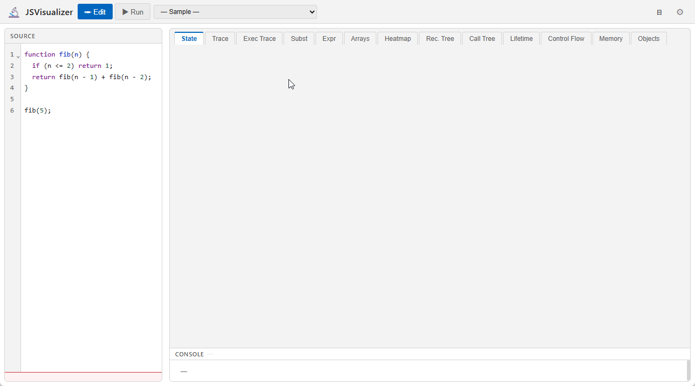

# JSVisualizer

> 🚀 **[Live Demo](https://tntetsu.github.io/JSVisualizer/)** — GitHub Pages でホスト中

> [English README](README.en.md)

JavaScript プログラムの実行過程をインタラクティブに可視化する教育用 Web アプリケーションです。

式・文・関数呼び出しの各粒度でステップ実行しながら、**13 種類の可視化ビュー**でプログラムの動作（時間の経過とともにメモリの内容がどう変化するか）を直感的に理解できます。



---

## 特徴

### ステップ実行の粒度（8方向ボタン）

フッターの 2行×4列グリッドで 4 粒度 × 前後 = 8 種類のステップ操作が可能です。

```
⏮  │  ◀◀文   ◀式   ▶式   ▶▶文  │  ⏭  ── スライダー ── カウンタ
   │  ⏪関   ◁人   ▷人   ⏩関  │
```

| 粒度 | ボタン | キーボード | 説明 |
|------|--------|-----------|------|
| **式評価** | ◀式 / ▶式 | `b`/`←`、`n`/`→` | 全 AST ノードの評価（最細粒度） |
| **文評価** | ◀◀文 / ▶▶文 | `V` / `v` | 文単位（サブ式をスキップ） |
| **人にやさしい単位** | ◁人 / ▷人 | `H` / `h` | 代入・条件判定・ループ更新など意味ある変化点のみ |
| **関数呼び出し単位** | ⏪関 / ⏩関 | `F` / `f` | 関数呼び出し・リターンをひとまとまりに |

その他: `Home` → 先頭へ、`End` → 末尾へ、`1`〜`9` → タブ切り替え

### コードハイライト（3層）

コード表示エリアでは以下の 3 層が同時に視覚化されます。

| 層 | 色 | 意味 |
|----|-----|------|
| 行ハイライト | 🟦 青（左ボーダー＋背景） | 現在実行中の行 |
| 式ハイライト | 🟧 オレンジ（半透明） | 現在評価中の式の文字範囲 |
| 呼び出し元ハイライト | 🟣 パープル（破線アンダーライン） | 関数内部を実行中のとき、その関数を呼び出した式 |

### 可視化ビュー（13 種類）

タブ切り替えで以下のビューを利用できます。

| カテゴリ | タブ名 | 説明 |
|----------|--------|------|
| **基本** | コールスタック | Global＋関数呼び出しフレームごとの変数値パネル（最内側関数先頭・`factorial(6)` 形式ラベル） |
| **トレース** | トレース表 | 行番号列にソース先頭 15 文字スニペットを表示する変数マトリクス表。変化した変数値を橙太字で強調。列の表示/非表示・D&D 並び替え可 |
| | 実行トレース | humanStep の実行順に全ステップを一覧。変数値列・条件式列を表示。変化した値を橙太字で強調。while/for の条件式はイテレーションごとに値を表示 |
| | 代入展開 | 再帰関数呼び出しを置換モデルで逐次展開。呼び出し式が return 式に置き換わる過程を展開ハイライト（橙）・次置換項ハイライト（青太字）付きで表示 |
| | 式評価 | 代入・宣言・if/while/for 条件・return 引数など1行の式の部分式を逐次置換しながら最終値に収束する過程をトレース表形式で表示。変数値はステップごとにリアルタイム更新。2色ハイライト付き |
| **グラフ系** | 配列 | 複数の配列を色付き箱でインデックス付き表示。ポインタ変数は変数ごとに個別行で表示。各配列ブロックは枠線＋背景色で区切り、幅不足時は次行へ折り返し。ステップ間で配列位置が動かないよう最大サイズで領域を確保 |
| | ヒートマップ | 各行の実行回数を「N回/M回」形式＋背景色でステップごとに動的更新。時系列ドット（実行済み/未実行色分け、360px幅）も可視化。異なる行へ遷移する連続ドット間を SVG 縦線で常時表示 |
| **構造系** | 再帰ツリー | **再帰呼び出しのみ**を SVG ツリーで表示。各ノードにサブツリーコスト（cost:N）を表示 |
| | 呼び出しツリー | 全関数呼び出し（再帰に限らない）を SVG ツリーで表示 |
| | ライフタイム | 変数の生存期間を SVG Gantt チャートで表示 |
| | 制御フロー | AST ベースのフローチャート（if/else を true/false 列で横並び・ループは条件＋本体）。未実行ノードをグレーで表示し通らなかった分岐が一目でわかる |
| | メモリモデル | スタック（スコープフレーム）とヒープ（オブジェクト・配列）を分離表示。SVG 矢印で参照関係を表現 |
| | オブジェクト | オブジェクト・配列の参照関係を SVG グラフで表示（階層型レイアウト。連結成分を自動分離・ノードを背景色で色分け） |

Console 出力（`console.log` ログ）は、どのタブを選択中でも右ペイン下部の**常時表示パネル**に表示されます（上端ドラッグで高さ変更可）。

### エディタ機能

- **シンタックスハイライト** — CodeMirror 6 によるキーワード・文字列・コメントの色分け（ライト/ダークテーマ連動）
- **ペインリサイザー** — 左右ペインの境界をドラッグして幅を自由に調整（幅は自動保存）
- **プログラム名表示** — サンプルを選択するとヘッダーにサンプル名を表示

### テーマ

右上の ⚙ ボタンから**ライトテーマ**と**ダークテーマ**を切り替えられます。
デフォルトはライトテーマ。設定は自動的に保存され、次回起動時も維持されます。

### 言語（日本語 / English）

ヘッダーの **EN / 日** ボタンで表示言語を切り替えられます。ボタンラベル・タブ名・説明文・設定パネルなど UI 全体（約 46 項目）が即座に切り替わります。デフォルトは日本語。設定は自動的に保存され、次回起動時も維持されます（エラーメッセージとサンプルプログラム名は対象外）。

### その他

- **ステップバック対応** — 過去のステップに戻れる（O(1)）
- **サンプルコード 21 種内蔵** — バブルソート・フィボナッチ（再帰/DP）・クラスと継承・連結リストなど
- **分割代入サポート** — `[a, b] = [b, a]` などのスワップ構文に対応
- **カスタムコード対応** — 自分で書いた JavaScript を貼り付けて実行
- **設定永続化** — テーマ・最後に見ていたタブ・ペイン幅を localStorage に保存し次回起動時に復元
- **色覚多様性対応** — 色だけでなく形・パターン・アイコンで状態を表現
- **わかりやすいエラー表示** — 構文エラー/実行エラーをバッジ付きで表示

---

## インストール

```bash
git clone https://github.com/tntetsu/JSVisualizer.git
cd JSVisualizer
npm install
```

> JSInterpreter が `../JSInterpreter` に存在する必要があります。

```bash
# JSInterpreter が未取得の場合
cd ..
git clone https://github.com/tntetsu/JSInterpreter.git
cd JSVisualizer
```

---

## 使い方

### 開発サーバーの起動

```bash
npm run dev
```

ブラウザで `http://localhost:8000` を開いてください。ファイルを保存すると自動的に再ビルドされます。

### 本番ビルド

```bash
npm run build
# web/ 以下に成果物が生成されます
```

### テスト

```bash
npm test
```

---

## サンプルコード（21 種類）

| カテゴリ | サンプル |
|---------|---------|
| **探索** | 線形探索、二分探索 |
| **ソート（基本）** | バブルソート、選択ソート |
| **ソート（高度）** | クイックソート、マージソート |
| **ソート（オブジェクト）** | 数値キーでソート、文字列キーでソート |
| **数学・アルゴリズム** | ユークリッド互除法（ループ/再帰）、階乗、フィボナッチ（再帰）、フィボナッチ（DP/メモ化） |
| **データ構造** | 二分木構築・探索、連結リスト |
| **スコープ・オブジェクト** | クロージャ、クラスと継承 |
| **Study Tasks** | [Warm-up] 階乗（ループ）、[Task 1] 選択ソート（バグあり）、[Task 2] フィボナッチ（呼び出し回数）、[Task 3] バブルソート（中間状態） |

---

## 対象ユーザー

- **プログラミング学習者** — 自分のコードの動作を一歩ずつ確認したい
- **教員** — 授業で動くプログラムを見せながら解説したい
- **教材制作者** — トレース図のアニメーションを手軽に作りたい

---

## 背景・動機

プログラミング教育において、学生がバグの修正に苦労する主な原因は「プログラムの動作の理解不足」です。紙や静的なスライドでは動作が伝わりにくく、既存のトレースツール（Algorithm Visualizer、Python Tutor など）は可視化専用コードの埋め込みが必要だったり、表示が見にくいという問題があります。

JSVisualizer は **汎用の JavaScript インタープリタ**を内蔵することで、任意のコードを貼り付けるだけで多彩な可視化を提供します。

---

## 技術スタック

| 項目 | 採用技術 |
|------|----------|
| コアエンジン | [JSInterpreter](../JSInterpreter)（自作 JS インタープリタ） |
| フロントエンド | Vanilla JS (ES2022+) + HTML + CSS |
| ビルドツール | esbuild |
| テスト | Jest（70 テスト） |
| コードエディタ | CodeMirror 6 |
| 可視化 | DOM + CSS アニメーション + SVG 手動描画 |
| テーマ | CSS カスタムプロパティ（Catppuccin Latte / Mocha） |
| CI/CD | GitHub Actions → GitHub Pages |

---

## ドキュメント

- [機能仕様書](docs/functional-spec.md)
- [詳細設計書](docs/design.md)
- [開発計画書](docs/development-plan.md)

---

## ライセンス

MIT
